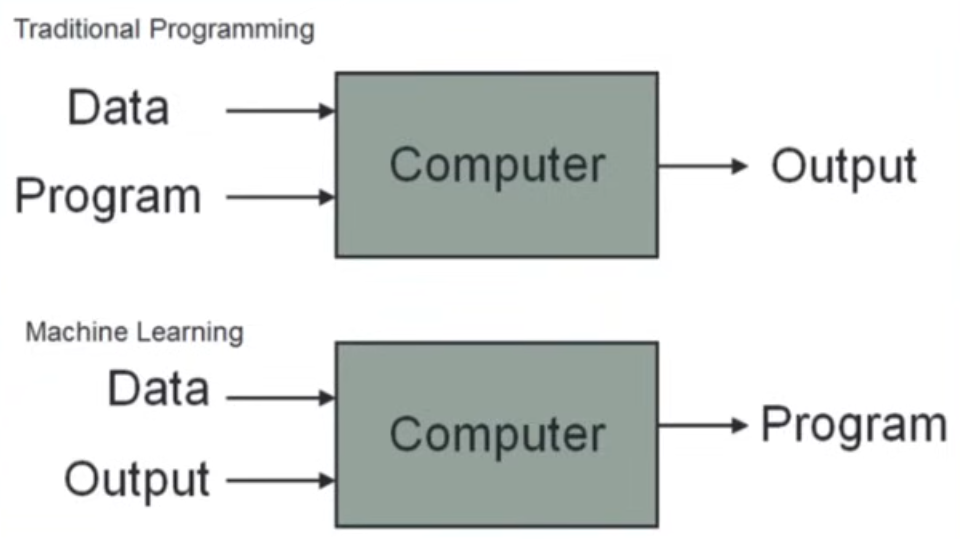

# Machine Learning

Machine learning is a field of computer science that uses statistical techniques to give computer systems the ability to "learn" from data, without being explicitly programmed.

## Traditional Programming vs Machine Learning

## When to Use Machine Learning

- For instance Email Spam Detection
- Image classification
- data mining.

## History of Machine Learning

- 1950s: The term "machine learning" was coined by Arthur Samuel, who developed a program that could play checkers and improve its performance over time.
- 1980s: The development of neural networks and back propagation algorithms led to significant advancements in machine learning.
- 1990s: The rise of the internet and the availability of large datasets led to the development of new machine learning algorithms and techniques.
- 2000s: The advent of big data and cloud computing has further accelerated the growth of machine learning, leading to the development of deep learning and other advanced techniques.
