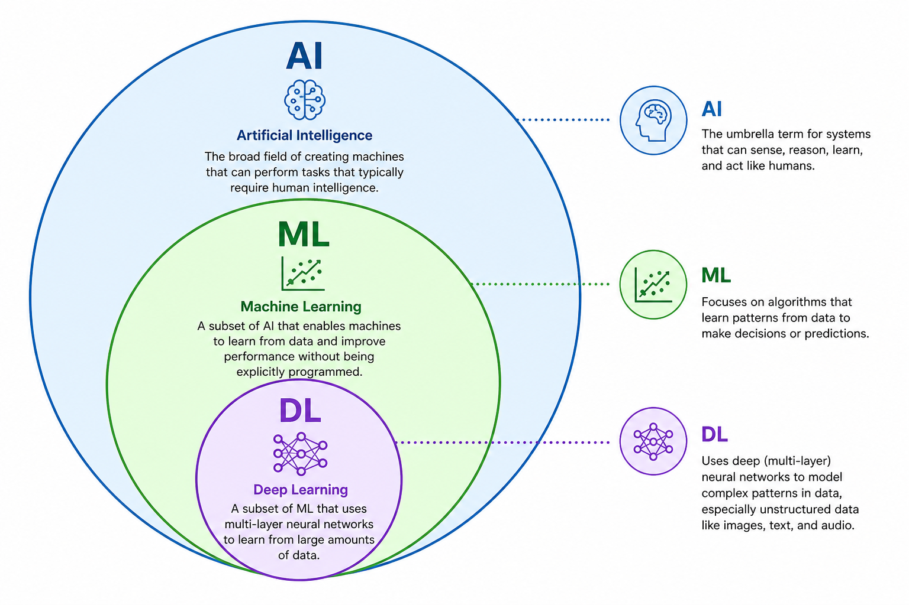

# Artificial Intelligence (AI) vs Machine Learning (ML) vs Deep Learning (DL)

### Main difference between ML and DL is feature engineering. In ML, we need to do feature engineering manually, while in DL, the model learns to extract features automatically from the data.

### Feature engineering

Feature engineering is the process of selecting, transforming, and creating input variables (features) from raw data to improve machine learning model performance. It involves using domain knowledge to extract the most relevant information, making data suitable for algorithms to learn patterns more effectively.
