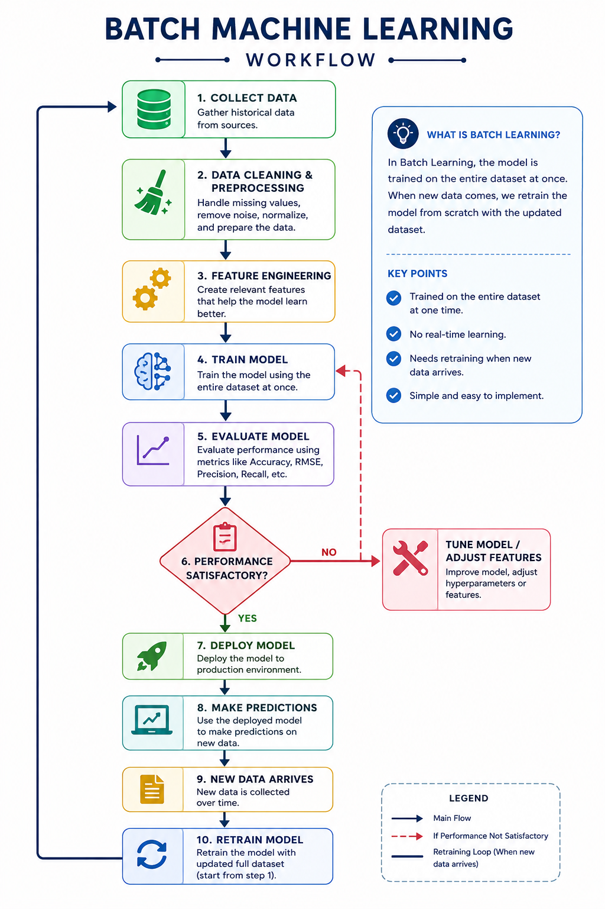

# Types of Machine Learning Based on Production

**1. Batch Machine Learning**

**2. Online Machine Learning**

# 1. Batch Machine Learning

In batch machine learning, the model is trained on a fixed dataset that is collected and processed in batches. The model learns from this static dataset, and once training is complete, it can be used to make predictions on new data.

## Disadvantages of Batch Machine Learning

- Lots of data
- Hardware limitations
- Availability
