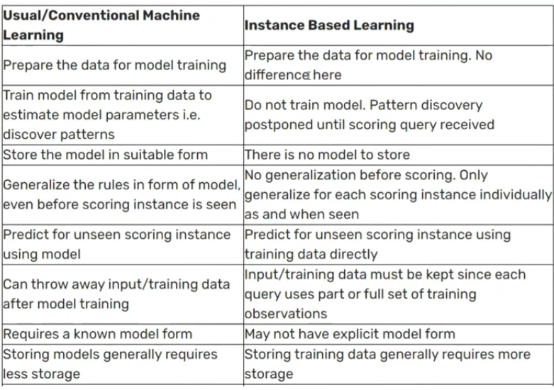

# Instance-Based vs Model-Based Machine Learning

## Learning

1. Memorizing
2. Generalizing

## Instance-Based Learning

Instance-based learning, also known as lazy learning, is a type of machine learning where the model learns by memorizing the training data. It does not build an explicit model but instead makes predictions based on the similarity between new data points and the stored instances.

#### Example of Instance-Based Learning

- k-Nearest Neighbors (KNN)

## Model-Based Learning

Model-based learning is a type of machine learning where the model learns by building an explicit model of the data. It generalizes from the training data to make predictions on new data points.

## Key Differences between Instance-Based and Model-Based Learning

