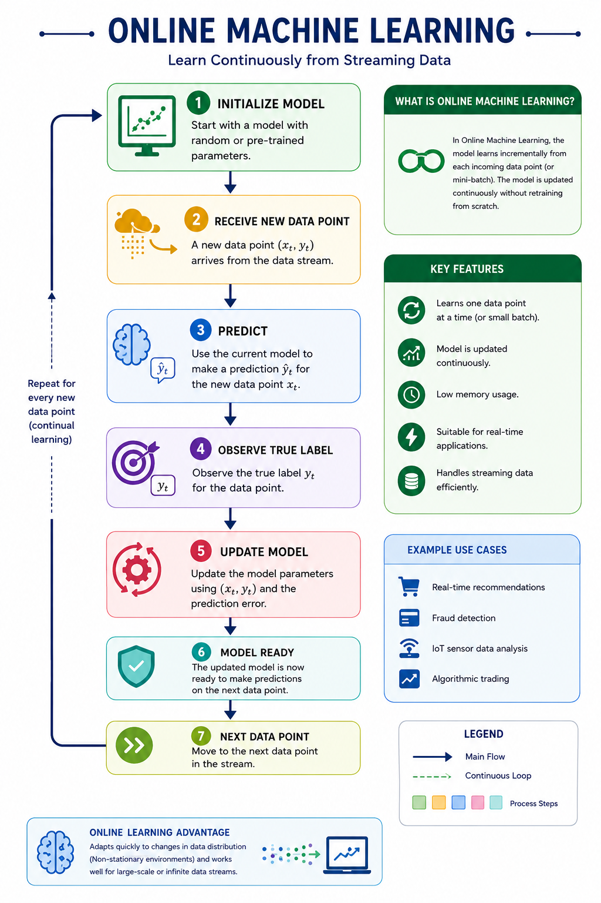
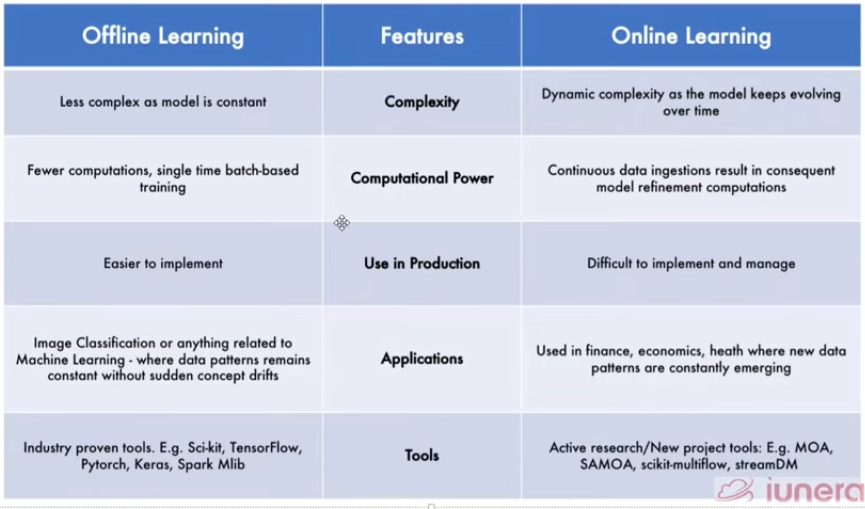

# 2. Online Machine Learning

Online machine learning is a method of training machine learning models incrementally, allowing them to learn from data as it becomes available. This approach is particularly useful in scenarios where data is continuously generated, such as in streaming applications or when dealing with large datasets that cannot be processed all at once.

### Example of Online Machine Learning

- Chatbots that learn from user interactions
- Real-time recommendation systems like Netflix or Amazon
- Fraud detection systems that analyze transactions in real-time

## When to Use Online Machine Learning

- **When there is a concept drift**, meaning the underlying data distribution changes over time
- **Cost effectiveness**, as it can be more efficient to update models incrementally rather than retraining from scratch
- **Faster solutions**, as it allows for real-time predictions and updates without the need for batch processing.

## How to Implement Online Machine Learning

- scikit-learn's `partial_fit` method: Allows for incremental learning with certain algorithms.
- **River Library:** A Python library for online machine learning
- **Vowpal Wabbit:** A fast online learning system that supports a variety of algorithms and is designed for large-scale machine learning tasks.

## Learning Rate

Learning rate is a crucial hyperparameter in online machine learning that determines how much the model's parameters are updated with each new data point. A higher learning rate can lead to faster convergence but may cause the model to overshoot optimal parameters, while a lower learning rate can lead to more stable updates but may require more time to converge.

## Out of Core Learning

Out of core learning is a technique used in online machine learning to handle datasets that are too large to fit into memory. It allows the model to learn from data that is stored on disk, processing it in smaller chunks or batches. This approach is essential for training models on large datasets without running into memory issues.

## Disadvantages of Online Machine Learning

- **Tricky to use**: Requires careful tuning of hyperparameters and may not be suitable for all types of problems.
- **Risky**: If not implemented correctly, it can lead to poor model performance or convergence issues.

## Batch vs Online Machine Learning

