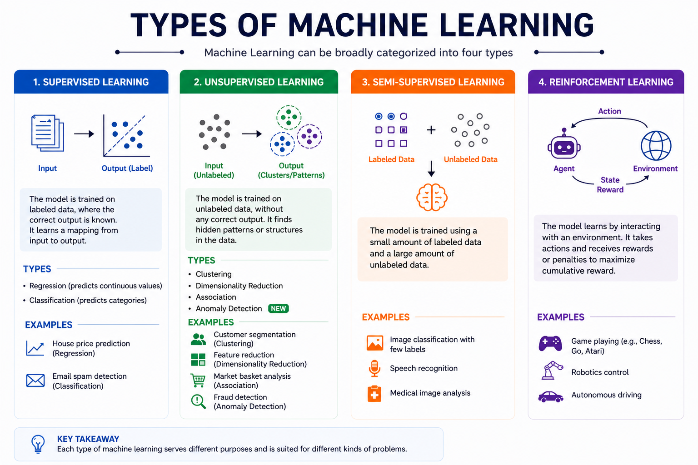
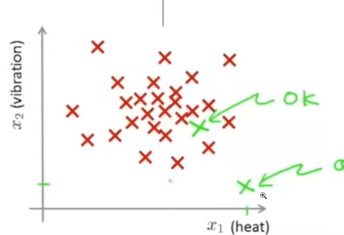
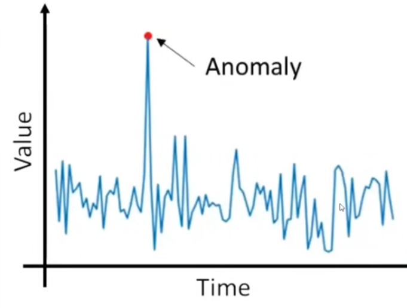
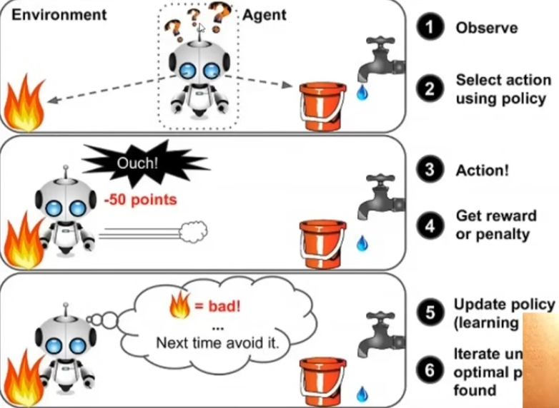

# Supervision in Machine Learning (ML)

In **Machine Learning (ML)**, _supervision_ refers to whether the model is trained using **labeled data**—that is, data where the correct answers are already known.

---

## 🔹 Supervision (Simple Explanation)

Supervision means the model learns from examples where both:

- **Input (X)** → the data (e.g., images, text, numbers)
- **Output (Y)** → the correct answer (label)

So the model is basically being “taught” with guidance.

---

# Labeled Data in Machine Learning

**Labeled data** is a dataset where each input example has a corresponding output tag or answer — the "correct answer" that tells the model what it should learn to predict.

---

## Simple Example

| Input (Feature)      | Label (Target) |
| -------------------- | -------------- |
| Photo of a cat       | `"cat"`        |
| Email with "win $$$" | `"spam"`       |
| House: 3BR, 1200sqft | `"$350,000"`   |

# Types of Machine Learning Based on Supervision



## 1. Supervised Learning

Build relationships between input and output using labeled data. The model learns to predict the output from the input.

```
For example, placement of students in a class based on their iq and CGPA.
```

### Types of Data:

1. Numerical Data
   - Age
   - Salary
   - Temperature
2. Categorical Data
   - Gender
   - Country
   - Product Category
   - Brand
   - Nationality

### 1.1 Regression

If the output variable is continuous (e.g., price, temperature), it's a regression problem.

```
For example, predicting the price of a house based on its size, location, and number of bedrooms.
```

### 1.2 Classification

If the output variable is categorical (e.g., "spam" vs "not spam"), it's a classification problem.

```
For example, classifying emails as "spam" or "not spam" based on their content.
```

## 2. Unsupervised Learning

In unsupervised learning, the model learns from data that does not have labeled outputs. The goal is to find hidden patterns or structures in the data.

```
For example, grouping customers into segments based on their purchasing behavior without knowing the categories beforehand.

```

### Types of Unsupervised Learning:

1. Clustering
   - Grouping similar data points together (e.g., customer segmentation, student types).
2. Dimensionality Reduction
   - Reducing the number of features while retaining important information (e.g., PCA).
   - column reduction
3. Anomaly Detection
   - Identifying unusual data points (e.g., fraud detection).
     
     

4. Association Rule Learning
   - Finding interesting relationships between variables in large datasets (e.g., market basket analysis).

## 3. Semi-Supervised Learning

Partially supervised and partially unsupervised. The model learns from a small amount of labeled data and a large amount of unlabeled data.

```
For example, google photos uses semi-supervised learning to recognize faces in photos. It has a small amount of labeled data (photos with known faces) and a large amount of unlabeled data (photos without labels).
```

## 4. Reinforcement Learning

No input data or output labels. The model learns by interacting with an environment and receiving feedback in the form of rewards or penalties.


