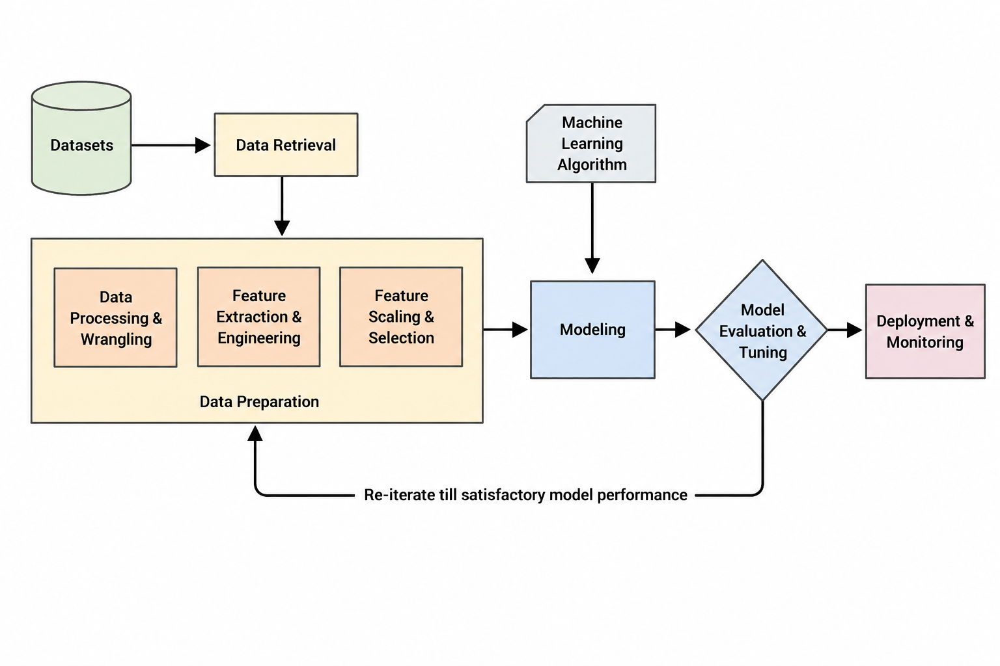
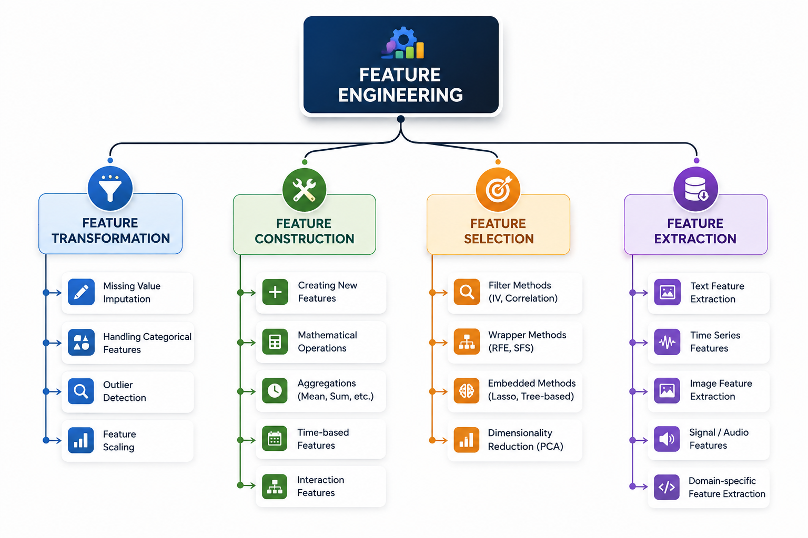

# Feature Engineering
Feature engineering is the process of using domain knowledge to extract features from raw data. This feature can be used to improve the performance of machine learning algorithms.

## Flow of Feature Engineering:
