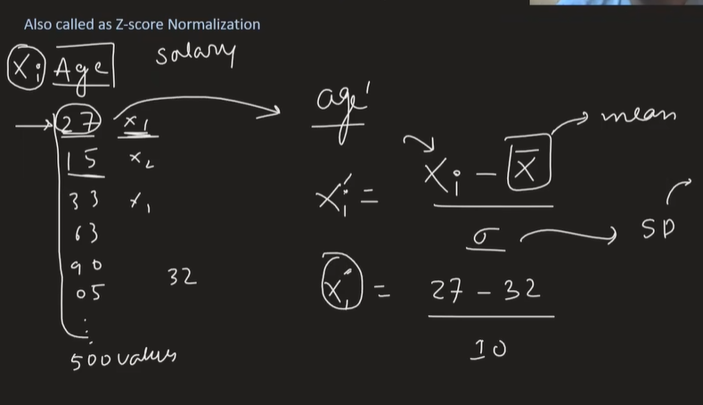
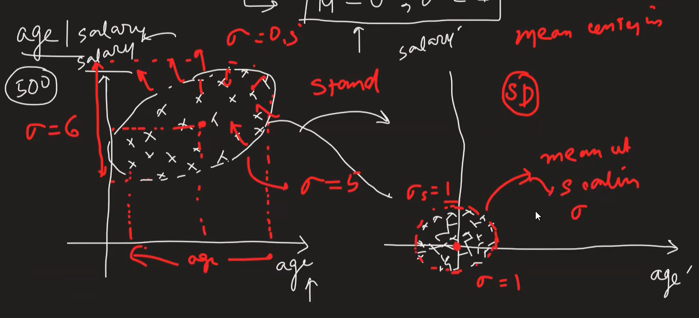
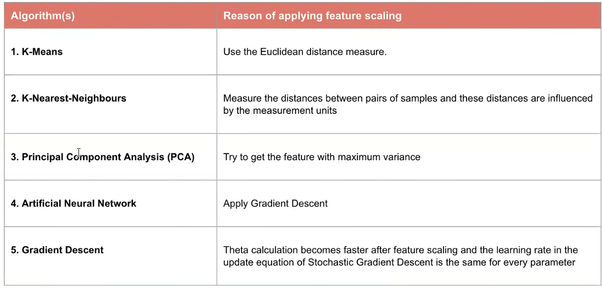

# Feature Scaling : Standardization

## Why we need to scale features?
We need feature scaling because features in a dataset can have different ranges and units. For example, one feature may be in the range of 0-1, while another may be in the range of 0-1000. This can lead to issues when training machine learning models, as some algorithms are sensitive to the scale of the input features.

## Types of Feature Scaling:
- Standardization
- Normalization

## Standardization

μ = 0 and σ = 1

## Intution

## Example

## Impact of Outliers

## When to use Standardization?
