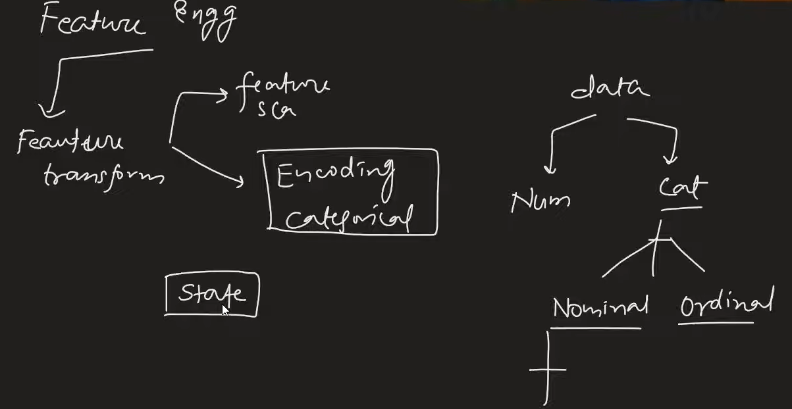

# Ordinal Encoding

## Why Encoding is Important?
Machine learning models are essentially giant calculators. Because they perform mathematical operations (like multiplication and matrix addition), they can only read numbers, not text.

Encoding is the process of converting text labels or categorical data into a numerical format so that machine learning algorithms can understand and process them.

### Common Encoding Methods at a Glance
 **Label Encoding:** 
 Converts each text category into a unique integer (e.g., Red = 0, Green = 1, Blue = 2). Best for Ordinal data.
 
 **One-Hot Encoding:** Creates a new column for every unique category and uses 1s and 0s (e.g., a "Is_Red" column gets a 1 or 0). Best for Nominal data.
 
 **Target Encoding:** Replaces text categories with the average value of the target output. Best for handling categories with hundreds of unique values (like Zip Codes).