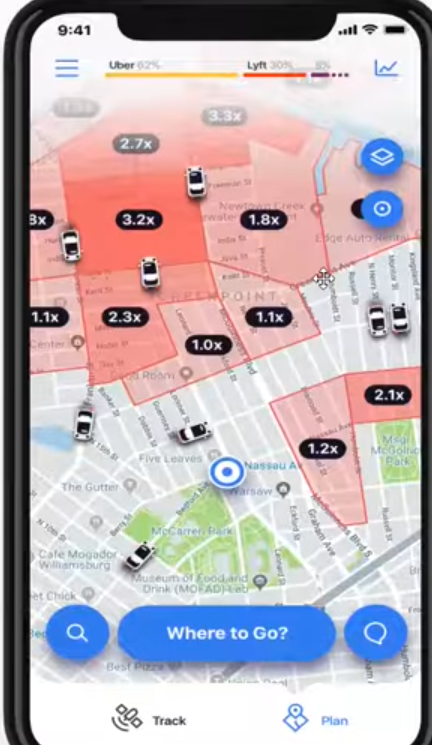
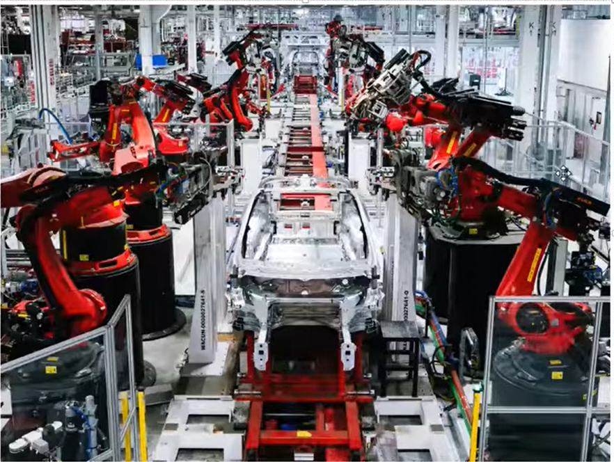

# Applications of Machine Learning

Machine learning has a wide range of applications across various industries. Here are some of the key areas where machine learning is being applied:

## 1. Retail - Amazon/Big Bazar/ Shaowpno
    ```
    For Example: Amazon uses machine learning for personalized recommendations, inventory management, and customer service chatbots. Big Bazar and Shaowpno can use machine learning for demand forecasting, optimizing supply chain, and improving customer experience through personalized offers and promotions. 
    ```

## 2. Banking and Finance - Fraud Detection, Credit Scoring, Algorithmic Trading
```
    For Example: Banks use machine learning for fraud detection by analyzing transaction patterns and identifying anomalies. Credit scoring models use machine learning to assess the creditworthiness of individuals based on their financial history. Algorithmic trading uses machine learning to analyze market data and make trading decisions in real-time.
```


## Transportation
```
    For Example: Ride-sharing companies like Uber and Lyft use machine learning for route optimization, demand prediction, and dynamic pricing. Autonomous vehicles use machine learning for object detection, decision making, and navigation.
```


## Manufacturing - Tesla
```
    For Example: Tesla uses machine learning for predictive maintenance, quality control, and optimizing production processes. Machine learning can help identify potential issues in machinery before they occur, improving efficiency and reducing downtime.
```


## Consumer Internet - Facebook, Instagram, YouTube, **Twitter**, TikTok
```
    For Example: Social media platforms like Facebook, Instagram, and YouTube use machine learning for content recommendation, ad targeting, and user engagement analysis. Machine learning algorithms analyze user behavior to personalize the content and advertisements shown to each user.
```

```
Another example is sentiment analysis on Twitter, where machine learning is used to analyze the sentiment of tweets to understand public opinion on various topics.
```
