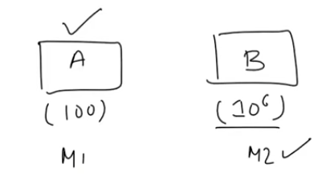
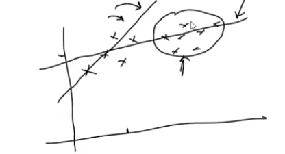
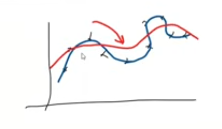
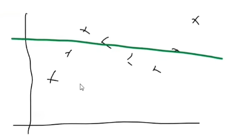

# Challenges in Machine Learning

Machine learning, while powerful, comes with its own set of challenges. Here are some of the key challenges faced in the field:

## 1. Data Collection

Finding preferred and high-quality data can be difficult. Data may be incomplete, noisy, or biased, which can affect the performance of machine learning models.

## 2. Insufficient Data/Labeled Data

Many machine learning algorithms require large amounts of labeled data to train effectively. In some cases, obtaining such data can be expensive or time-consuming.

## 3. Non Representative Data

If the training data is not representative of the real-world scenarios where the model will be applied, it can lead to poor performance and generalization issues.

- **Sampling Noise**: The data collected may not accurately represent the underlying distribution, leading to models that perform well on training data but poorly on unseen data.

- **Sampling Bias**: If the data is collected in a way that favors certain outcomes or groups, the model may learn to make biased predictions.

  

## 4. Data Quality

Poor data quality, such as missing values, outliers, or incorrect labels, can significantly impact the performance of machine learning models. It is crucial to preprocess and clean the data before training.

## 5. Irrelevant Features

If we put irrelevant data into the model, it can lead to overfitting, where the model learns noise instead of the underlying pattern. Feature selection and engineering are important steps to mitigate this issue.

Ex: Running Marathon in terms of fiteness, age, height, weight, location. Here, location may not be relevant features for predicting marathon performance.

## 6. Overfitting

Overfitting occurs when a model learns the training data too well, including its noise and outliers, which leads to poor generalization to new data. It is important to use techniques such as cross-validation, regularization, and pruning to prevent overfitting.

## 7. Underfitting

Underfitting happens when a model is too simple to capture the underlying patterns in the data, resulting in poor performance on both training and test data. It is important to choose an appropriate model complexity and ensure that the model is trained adequately.

## 8. Software Integration

## 9. Offline learning and Deployment

## 10. Cost Involved
