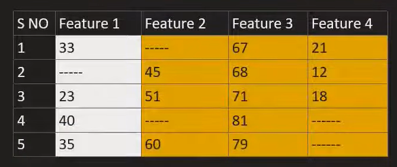
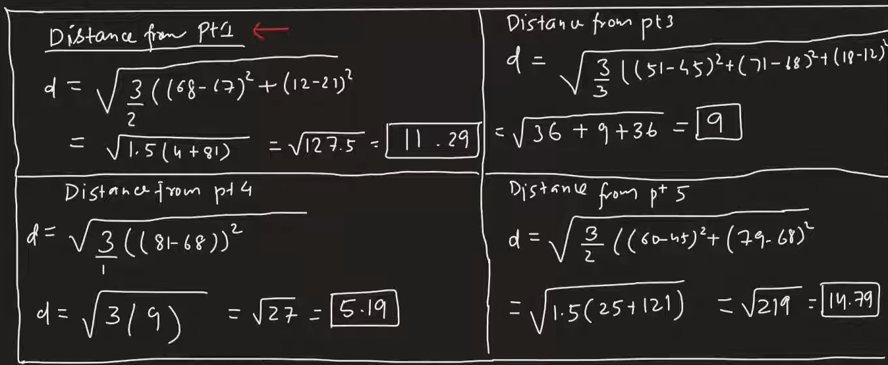

# KNN Imputer 
Works on a algorithm called KNN (K Nearest Neighbor) which is used to impute the missing values in the dataset. It works on the principle of finding the k nearest neighbors of a data point and using their values to impute the missing value.

Link: https://scikit-learn.org/stable/modules/generated/sklearn.impute.KNNImputer.html

- find k nearest neighbors 
- find the value

### Nan Euclidean distance
is a method used to calculate the distance between two points in Euclidean space. It is commonly used in various machine learning algorithms, including imputation techniques like the Iterative Imputer.

Link: https://scikit-learn.org/stable/modules/generated/sklearn.metrics.pairwise.nan_euclidean_distances.html

## Advantages of KNN Imputer
- More accurate 

## Disadvantages of KNN Imputer
- Computationally expensive
- More time consuming
- More memory consumption
