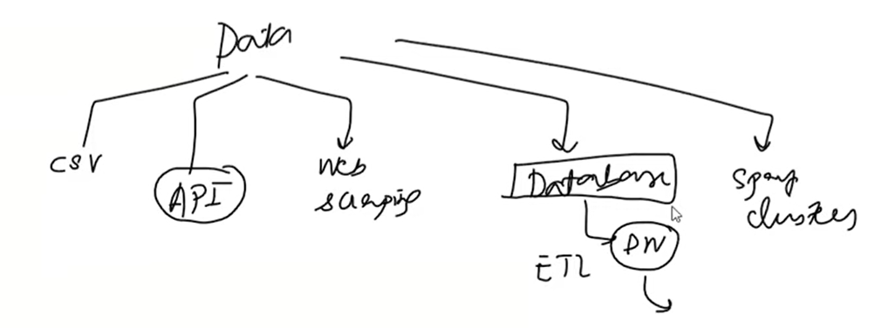

# Machine Learning Development Life Cycle - MLDLC/MLDC
Set of guide line when we are developing a machine learning model, we need to follow a systematic approach to ensure that the model is effective and efficient. The Machine Learning Development Life Cycle (MLDLC) or Machine Learning Development Cycle (MLDC) provides a structured framework for developing machine learning models. Here are the key stages of the MLDLC:

## 1. Frame the Problem
The first step in the MLDLC is to clearly define the problem you want to solve with machine learning. This involves understanding the business context, identifying the objectives, and determining the success criteria for the model.For example, if you are working on a student performance prediction model, you need to define what specific aspect of student performance you want to predict (e.g., final grades, dropout risk) and what metrics you will use to evaluate the model's performance.

## 2. Collect the Data
Once the problem is defined, the next step is to collect the relevant data. This may involve gathering data from various sources such as databases, APIs, or web scraping. It is important to ensure that the data collected is of high quality and relevant to the problem you are trying to solve. For example, if you are building a student performance prediction model, you may need to collect data on students' demographics, attendance records, previous academic performance, and other relevant factors.

## 3. Data Preprocessing
After collecting the data, it is essential to preprocess it to ensure that it is in a suitable format for machine learning algorithms.

## 4. Exploratory Data Analysis (EDA)
Exploratory Data Analysis (EDA) is the process of analyzing and visualizing the data to gain insights and understand the underlying patterns. This step helps in identifying any anomalies, outliers, or trends in the data that may affect the performance of the machine learning model. For example, if you are working on a student performance prediction model, you may use EDA to analyze the distribution of grades, identify any correlations between different features, and visualize the relationships between variables.

## 5. Feature Engineering and Selection
Feature engineering involves creating new features from the existing data that may help improve the performance of the machine learning model. Feature selection, on the other hand, involves selecting the most relevant features from the dataset to use in the model. This step is crucial as it can significantly impact the accuracy and efficiency of the model. For example, in a student performance prediction model, you may create new features such as average attendance rate or total study hours, and select only the most relevant features for training the model.

## 6. Model Training, Evaluation and Selection
Once the data is preprocessed and the features are engineered and selected, the next step is to train the machine learning model. This involves selecting an appropriate algorithm, splitting the data into training and testing sets, and fitting the model to the training data. After training, it is important to evaluate the model's performance using appropriate metrics such as accuracy, precision, recall, or F1 score. Based on the evaluation results, you may need to select a different algorithm or fine-tune the hyperparameters of the model to improve its performance.

## 7. Model Deployment
After selecting the best-performing model, the next step is to deploy it in a production environment. This involves integrating the model into an application or system where it can make predictions on new data. It is important to ensure that the deployment process is smooth and that the model can handle real-time data efficiently. For example, if you are deploying a student performance prediction model, you may integrate it into a school management system where it can provide predictions on student performance based on the input data.

## 8. Testing and Monitoring
After deploying the model, it is crucial to continuously test and monitor its performance in the production environment. This involves tracking the model's predictions, identifying any issues or errors, and making necessary updates or improvements to ensure that the model continues to perform well over time. For example, you may monitor the student performance prediction model to ensure that it is providing accurate predictions and make adjustments as needed based on feedback from users or changes in the data.

# 9. Model Maintenance and Optimization
Machine learning models require ongoing maintenance and optimization to ensure that they continue to perform well as new data becomes available and as the underlying patterns in the data may change over time. This involves regularly retraining the model with new data, fine-tuning the hyperparameters, and making necessary updates to the model architecture to improve its performance. For example, you may need to retrain the student performance prediction model periodically with new student data to ensure that it remains accurate and relevant.

- Model Backup
- Data Backup
- Load Balancing
- Model Versioning
- Model Retraining
- Model Optimization
