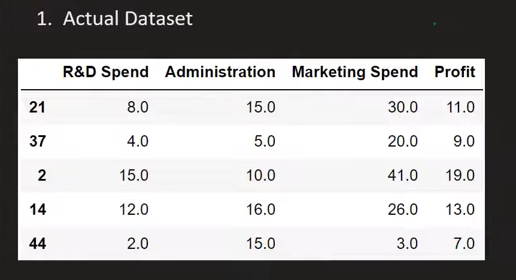
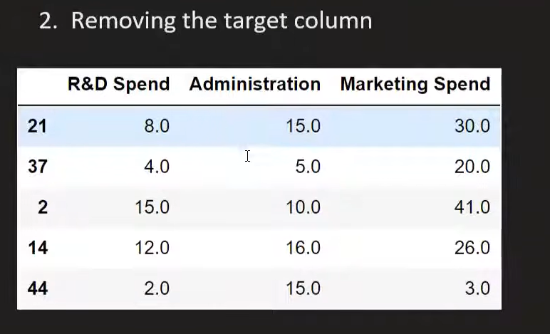
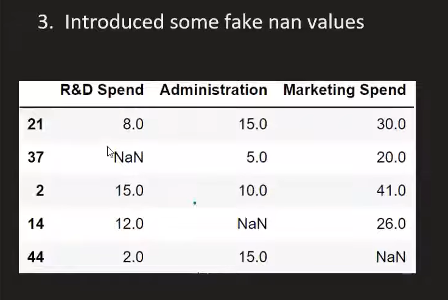
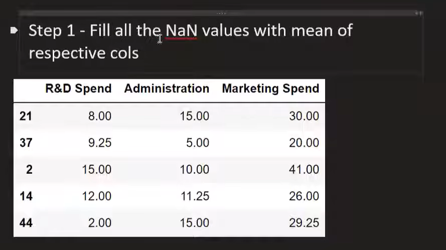
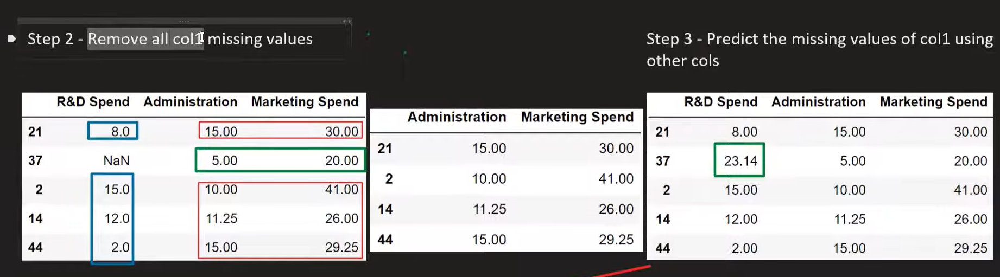
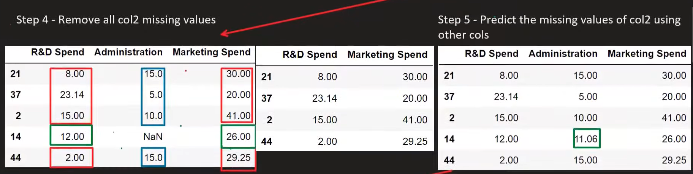
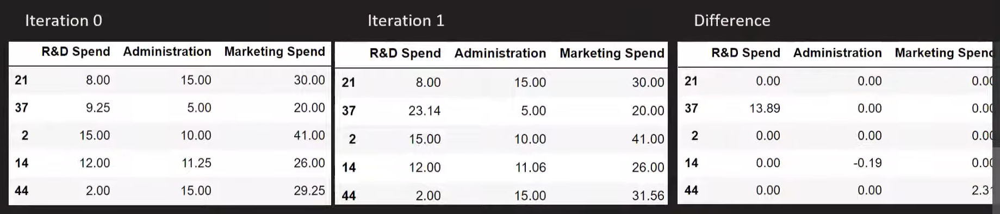
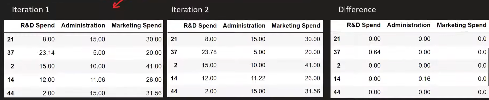
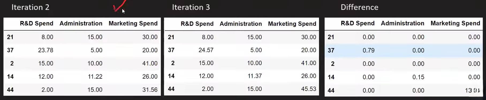

# Iterative Imputer / MICE

### MICE stands for Multivariate Imputation by Chained Equation

## Types of Missing Data
- MCAR (Missing Completely at Random): The missingness of the data is completely random and not related to any other variable in the dataset.
- MAR (Missing at Random): The missingness of the data is related to other observed variables in the dataset, but not to the missing values themselves.
- MNAR (Missing Not at Random): The missingness of the data is related to the missing values themselves, and cannot be explained by other observed variables in the dataset. 

## Step by Step Process of MICE

### Step 1: Replace missing values with mean, median or mode of the column.

