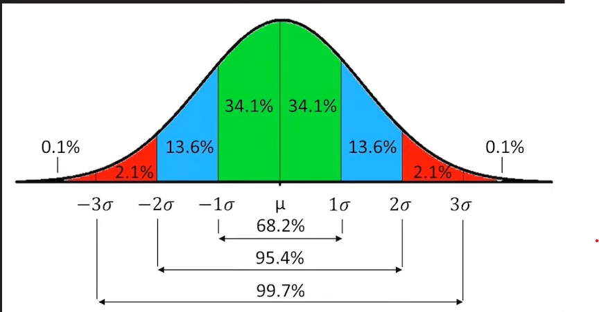
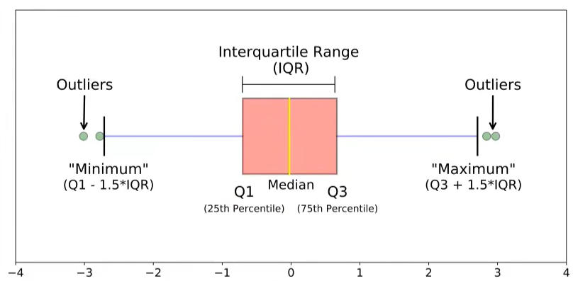
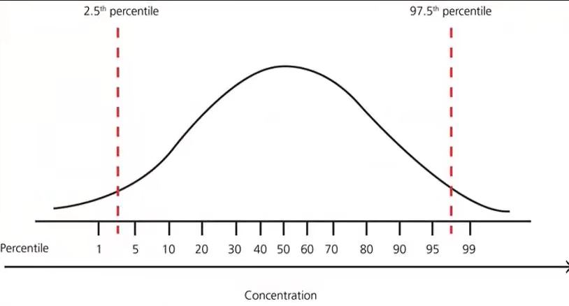

# Outliers

## What is an Outlier?
An outlier is a data point that differs significantly from other observations in a dataset.

## When does an Outlier dangerous?
An outlier can be dangerous when it skews the results of statistical analyses or machine learning models, leading to incorrect conclusions or poor performance.

For instance, when we work with data related to age, if a person age is 300 years, it is an outlier and can affect the mean and standard deviation of the dataset, leading to misleading insights. So we have to remove the outlier from the dataset to get accurate results.

In contrast, if we want to detect the anamoly of credit card transactions, an outlier can be useful to detect fraud. In this case, we want to keep the outlier in the dataset to identify suspicious transactions.

## Effect of Outliers
Liner regression, Logistic regression, Adaboost, KNN and Deep learning are some of the machine learning algorithms that are sensitive to outliers.

## How to treat Outliers?
- **Triming**: Remove completely the outlier from the dataset.
- **Capping**: Replace the outlier with a certain value, such as the maximum or minimum value of the dataset.

## How to detect Outliers?
1. **Normal Distribution**: If the data is normally distributed, we can use the Z-score method to detect outliers. A Z-score greater than 3 or less than -3 indicates an outlier.
**Equation**: μ + 3σ > X > μ - 3σ

2. **Skewed Distribution**: If the data is skewed, we can use the Interquartile Range (IQR) method to detect outliers. An outlier is defined as a data point that falls below Q1 - 1.5 * IQR or above Q3 + 1.5 * IQR.
**Equation**: Q1 - 1.5 * IQR > X > Q3

3. **Other Distributions**:

## Techniques for Outlier Detection
1. **Z-Score Method**: This method calculates the Z-score for each data point and identifies outliers based on a threshold (commonly 3 or -3).

2. **IQR Method**: This method calculates the interquartile range (IQR) and identifies outliers based on the 1.5 * IQR rule.

3.  **Percentile Method**: This method identifies outliers based on the percentiles of the data distribution, typically using the 1st and 99th percentiles.

4. **Winsorization**: This method replaces extreme values with the nearest value within a specified percentile range, effectively capping the outliers.