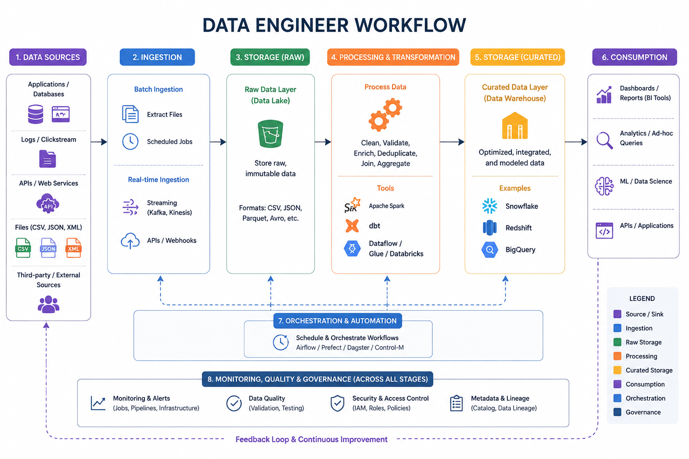
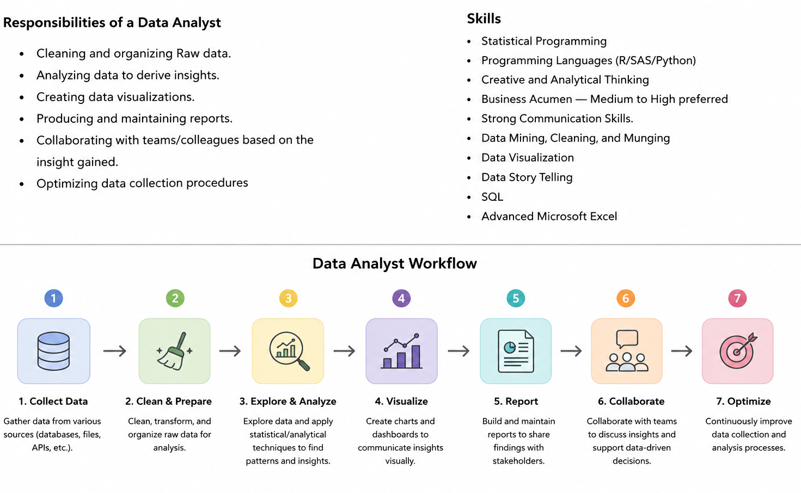
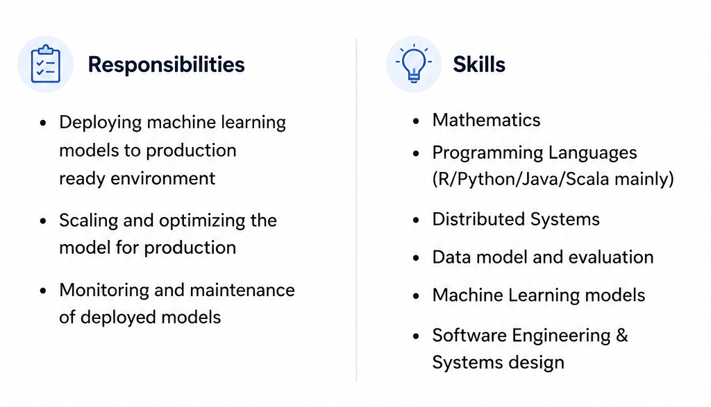
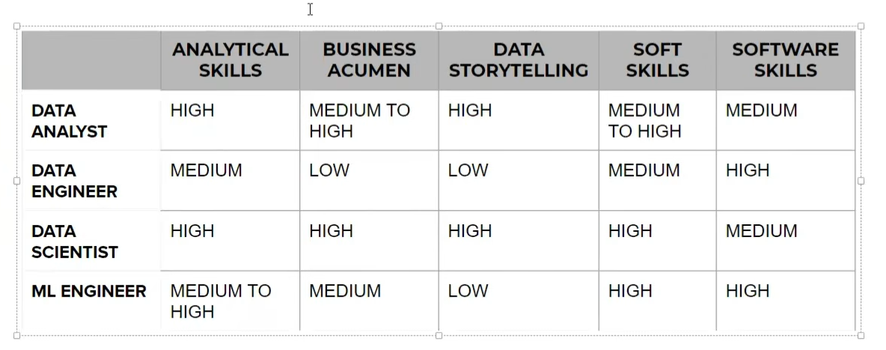

# Data Engineer vs Data Analyst vs Data Scientist vs ML Engineer

## Various Data Based Job Roles
- **Data Engineer**
- **Data Analyst**
- **Data Scientist**
- **Machine Learning Engineer**

## 1. Data Engineer

*Wednesday, March 24, 2021 — 1:25 PM*

---

### Job Roles

* Scrape data from the given sources.
* Move/store the data in optimal servers/warehouses.
* Build data pipelines/APIs for easy access to the data.
* Handle databases/data warehouses.

---

### Skills Required

* Strong grasp of algorithms and data structures
* Programming Languages (Java/R/Python/Scala) and script writing
* Advanced DBMS’s
* BIG DATA Tools (Apache Spark, Hadoop, Apache Kafka, Apache Hive)
* Cloud Platforms (Amazon Web Services, Google Cloud Platform)
* Distributed Systems
* Data Pipelines

## 2. Data Analyst

## 3. Data Scientist
A data scientist is someone who is better at statics than any software engineer and better at software engineering than any statistician. They are responsible for analyzing and interpreting complex data to help organizations make informed decisions. Data scientists use a combination of statistical analysis, machine learning, and programming skills to extract insights from data.

## 4. Machine Learning Engineer

## Comparison of Job Roles

### Blog Link [Click Here](https://medium.com/campusx/exploring-the-mystery-behind-different-job-titles-for-machine-learning-and-data-science-9352849f283a?source=collection_home---2------6-----------------------)