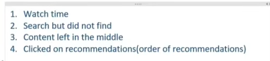

# How Frame a Problem

## 1. Business Problem to ML Problem

**Churn Rate**: The percentage of customers who stop using a product or service during a certain time frame.
For Example: Netflix: If 100 customers start using Netflix at the beginning of the month, and by the end of the month, 5 of those customers have canceled their subscriptions, the churn rate for that month would be 5%.

## 2. Types of Problems

Big Picture --> End Picture --> Prediction

## 3. Current Solution

## 4. Getting Data

## 5. Metrics to Measure

## 6. Online vs Batch Learning

## 7. Check Assumptions
